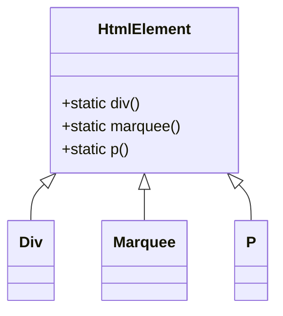

# Plan: Expand Main PHP Class to Cover All Possible HTML Elements

## Objective

Expand the PHP HTML builder to:
- Include a dedicated class for every HTML5 and deprecated HTML element (maximum coverage).
- Provide static factory methods in the main class (`HtmlElement`) for each element.

---

## 1. Inventory and Gap Analysis

- **Current Coverage:** 66 element classes found in `src/` (see appendix for list).
- **Required Coverage:** All HTML5 elements + all deprecated elements (see [MDN HTML element reference](https://developer.mozilla.org/en-US/docs/Web/HTML/Element)).
- **Action:** Compare the current list to the canonical list and identify missing elements.

---

## 2. Class Generation

- For each missing element, create a class:
  ```php
  class ElementName extends HtmlElement {
      public function __construct(/* relevant params */) {
          parent::__construct('elementname');
          // Optionally set default attributes or content
      }
  }
  ```
- Place each class in its own file: `src/elementname.php`.

---

## 3. Static Factory Methods

- In `HtmlElement`, add a static method for each element:
  ```php
  public static function elementname(/* params */) {
      return new ElementName(/* params */);
  }
  ```
- This enables usage like: `HtmlElement::div()`, `HtmlElement::marquee()`, etc.

---

## 4. Maintainability

- Maintain a master list of elements (e.g., in a JSON or PHP array) to automate class and method generation.
- Document the process for adding new elements in the future.

---

## 5. Documentation

- Update the README to explain:
  - How to use the static factory methods.
  - How to extend with new elements.
  - The project's coverage philosophy (all HTML5 + deprecated).

---

## 6. Example Mermaid Diagram



---

## 7. Implementation Steps

1. **List all HTML5 and deprecated elements.**
2. **Identify missing classes.**
3. **Generate missing class files.**
4. **Add static factory methods to `HtmlElement`.**
5. **Test instantiation and HTML output for all elements.**
6. **Update documentation.**

---

## Appendix: Current Element Classes

- Address
- Button
- Bdi
- Output
- I
- DataList
- Input
- Dfn
- Details
- Mark
- Dt
- Data
- Em
- Del
- Ins
- Dd
- Option
- Fieldset
- Param
- Iframe
- Blockquote
- Base
- Form
- Code
- Meter
- Dl
- Abbr
- Head
- Figure
- Cite
- H
- Audio
- Li
- Embed
- HtmlPicture
- Article
- A
- P
- Link
- Map
- Meta
- Object
- Nav
- Img
- Header
- Kbd
- Canvas
- Ol
- Col
- Bdo
- Colgroup
- Figcaption
- Aside
- Br
- Dialog
- HrElement
- Label
- Optgroup
- Area
- Div
- Legend
- Caption
- Noscript
- Footer
- Main
- Body

---

## Notes

- Deprecated elements (e.g., `<marquee>`, `<font>`, `<center>`, etc.) should be included for completeness.
- Custom elements (web components) are not included unless requested.
- For elements with special attributes or content, tailor the constructor as needed.

---