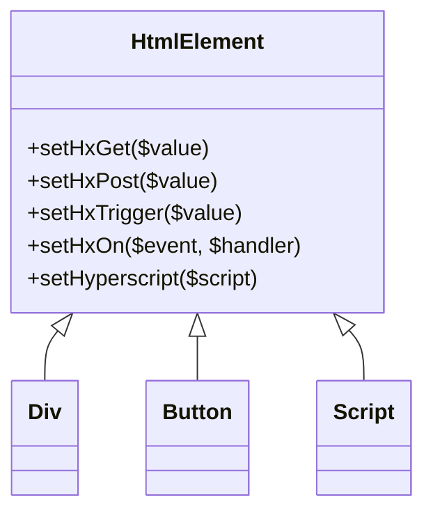

# Plan: Comprehensive HTMX & Hyperscript Support in PHP HTML Element Builder

## Objective

Implement comprehensive support for both HTMX and Hyperscript in the PHP HTML element builder by:
- Adding dedicated setters for all official HTMX attributes and events.
- Adding dedicated setter(s) for Hyperscript (`_` attribute and `<script type="text/hyperscript">`).
- Allowing any value for these attributes.
- Providing clear documentation and usage examples.

---

## 1. HTMX Attribute Inventory

**Core HTMX attributes (as of v1.9+):**
- hx-get
- hx-post
- hx-put
- hx-delete
- hx-patch
- hx-target
- hx-trigger
- hx-swap
- hx-vals
- hx-headers
- hx-include
- hx-params
- hx-push-url
- hx-select
- hx-select-oob
- hx-ext
- hx-confirm
- hx-disable
- hx-encoding
- hx-history
- hx-indicator
- hx-preserve
- hx-prompt
- hx-replace-url
- hx-request
- hx-sync
- hx-validate
- hx-vars
- hx-boost
- hx-on

**HTMX events:**  
All attributes starting with `hx-on:` (e.g., `hx-on:afterSwap`).

---

## 2. Hyperscript Attribute & Tag Support

- The `_` attribute (e.g., `<button _="on click ...">`)
  - Add a setter: `setHyperscript($script)` or `setUnderscore($script)`
- Inline `<script type="text/hyperscript">` blocks
  - Add a helper or dedicated class for this tag

---

## 3. Implementation Steps

1. **Add dedicated setters to HtmlElement:**
   - For each HTMX attribute, add a method:
     ```php
     public function setHxGet($value) { $this->attributes['hx-get'] = $value; return $this; }
     ```
   - For Hyperscript:
     ```php
     public function setHyperscript($script) { $this->attributes['_'] = $script; return $this; }
     ```
   - For HTMX events:
     ```php
     public function setHxOn($event, $handler) { $this->attributes["hx-on:$event"] = $handler; return $this; }
     ```
   - For Hyperscript script blocks:
     - Add a class or helper for `<script type="text/hyperscript">...</script>`

2. **Validation:**
   - Dedicated setters only allow valid attribute names.
   - Any value is accepted for the attribute.

3. **Documentation:**
   - Add docblocks to all setters.
   - Update README and usage examples to demonstrate both HTMX and Hyperscript support.

---

## 4. Usage Examples

### HTMX Examples

**Basic GET request:**
```php
$button = HtmlElement::button('Load Data')
    ->setHxGet('/api/data')
    ->setHxTarget('#result')
    ->setHxSwap('outerHTML');
echo $button->output();
```

**Trigger on custom event and push URL:**
```php
$link = HtmlElement::a('Next Page')
    ->setHref('#')
    ->setHxGet('/next')
    ->setHxTrigger('click')
    ->setHxPushUrl('true');
echo $link->output();
```

**HTMX event handler:**
```php
$div = HtmlElement::div('Content')
    ->setHxOn('afterSwap', 'console.log("Swapped!")');
echo $div->output();
```

### Hyperscript Examples

**Button with inline Hyperscript:**
```php
$button = HtmlElement::button('Click Me')
    ->setHyperscript('on click add .clicked to me');
echo $button->output();
```

**Hyperscript script block:**
```php
$script = new Script();
$script->setType('text/hyperscript')->text('def foo() log "Hello from Hyperscript" end');
echo $script->output();
```

**Combining HTMX and Hyperscript:**
```php
$button = HtmlElement::button('Load & Animate')
    ->setHxGet('/api/data')
    ->setHyperscript('on htmx:afterSwap add .animated to #result');
echo $button->output();
```

---

## 5. Mermaid Diagram



---

## 6. Future-Proofing

- Add a generic `setHxAttribute($name, $value)` for new/experimental HTMX attributes.
- Add a generic `setAttribute('_', $script)` for future Hyperscript changes.
- Document how to extend for future HTMX/Hyperscript releases.

---

## 7. Testing

- Add tests/examples for all HTMX and Hyperscript setters.
- Validate that all attributes are rendered correctly in output HTML.

---

## 8. Documentation

- Update README with a section on HTMX and Hyperscript support.
- Add usage examples for common HTMX and Hyperscript patterns.

---